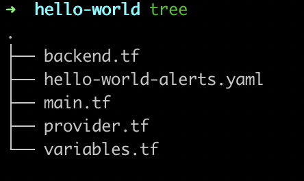
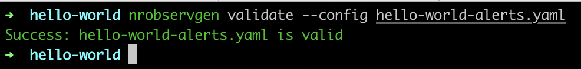

# nrobservgen
Generate declarative interface to generate newrelic alerts and dashboards. Terraform module that reads yaml file will create alerts and dashboards. 

## Install
`go get -u github.com/SennaSemakula/nrobservgen`

```
nrobservgen is a CLI tool used to automate the configuration management of your new relic observability stack

Usage:
   [command]

Available Commands:
  completion  generate the autocompletion script for the specified shell
  help        Help about any command
  template    Generate new relic monitoring template
  validate    Check whether your monitoring.yaml file is valid
  version     Print the version number of observgen

Flags:
  -h, --help   help for this command

Use " [command] --help" for more information about a command.
```
### Template command
Creates monitoring.yaml file to define your alerts and dashboards. Additionally creates terraform files required in current working directory. 
```
nrobservgen template --service <service_name>
```
### Template files:

### Validate command
Simulates a dry run by checking whether your alert runbooks, thresholds and values are valid. 
```
nrobservgen validate --config <config_file>
```
### valid config:

<br>
### invalid config:


